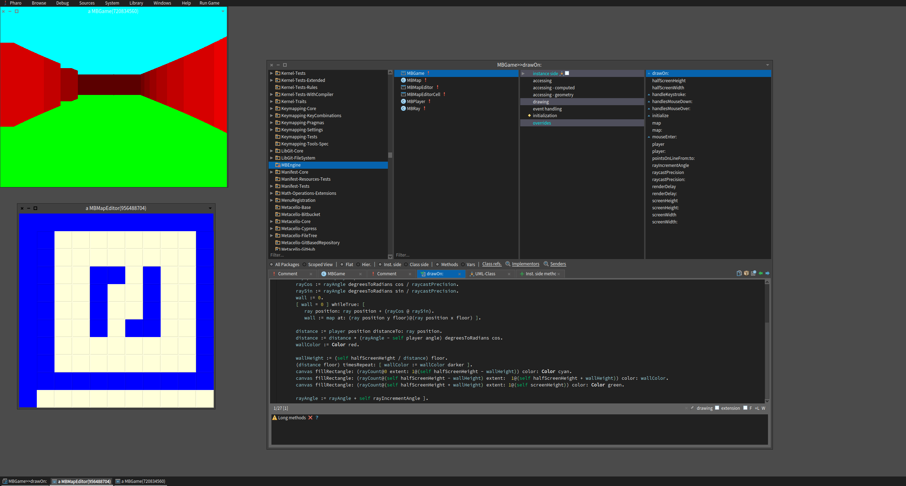

The MB Game Engine
===================
A raycasting FPS engine in Pharo. Very much a work in progress
 

This project is just to scratch an itch I've had since I started programming in Smalltalk.  An old school inspired FPS engine with Smalltalk's famous livliness.  

The basic raycasting method is from working through this wonderful tutorial: https://github.com/vinibiavatti1/RayCastingTutorial/wiki

